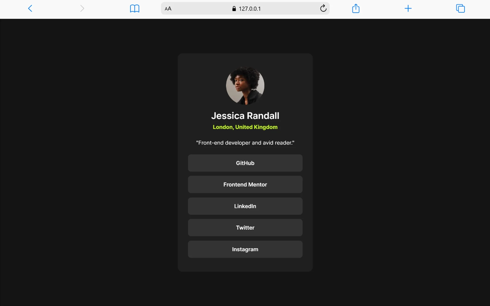

# Frontend Mentor - Social links profile solution

This is a solution to the [Social links profile challenge on Frontend Mentor](https://www.frontendmentor.io/challenges/social-links-profile-UG32l9m6dQ). Frontend Mentor challenges help you improve your coding skills by building realistic projects.

## Table of contents

- [Overview](#overview)
  - [The challenge](#the-challenge)
  - [Screenshot](#screenshot)
  - [Links](#links)
- [My process](#my-process)
  - [Built with](#built-with)
  - [What I learned](#what-i-learned)
  - [Continued development](#continued-development)
  - [Useful resources](#useful-resources)
  - [AI Collaboration](#ai-collaboration)
- [Author](#author)
- [Acknowledgments](#acknowledgments)

**Note: Delete this note and update the table of contents based on what sections you keep.**

## Overview

### The challenge

Users should be able to:

- See hover and focus states for all interactive elements on the page

### Screenshot



### Links

- Solution URL: [Add solution URL here](https://your-solution-url.com)
- Live Site URL: [Add live site URL here](https://your-live-site-url.com)

## My process

### Built with

- Semantic HTML5 markup
- CSS custom properties
- Flexbox

### What I learned

how to position elements effortlessly

```css
body {
  height: 100%;
}
.box {
  position: absolute;
  top: 50%;
  right: 50%;
  transform: translate(-50%, -50%);
}
```

### Continued development

CSS Paddings
CSS Margins
CSS Flexbox
CSS Grid
HTML Semantics

### Useful resources

- [ my brain]

## Author

- Frontend Mentor - [@thecodingmob](https://www.frontendmentor.io/profile/thecodingmob)
- Twitter - [@thecodingmob](https://www.twitter.com/thecodingmob)
